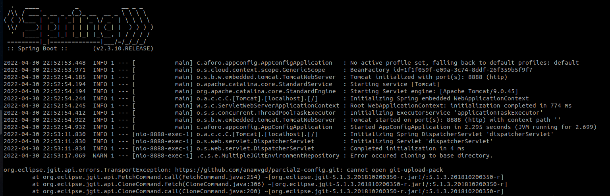

# Parcial 2 

## Información de los resultados
Hola profe, en este commit te pongo la prueba de como estan funcionando mis servicios, y los deploys, el unico que me falto por solucionar fue el pay.

## Los servicios corren y los deploy que eran necesarios para que el microservicio app pay que me asignaron funcionara.

## Error del config server 
El error del config server originalmente se debe a que no puede acceder al repositorio donde se tiene guardada toda la informacion que permite que se configure el ConfigServer, inicialmente, el url indicaba mi propio repositorio, verifique que mi SSH key estuviera funcionando pero tampoco arreglo el problema.

## Pods running 

